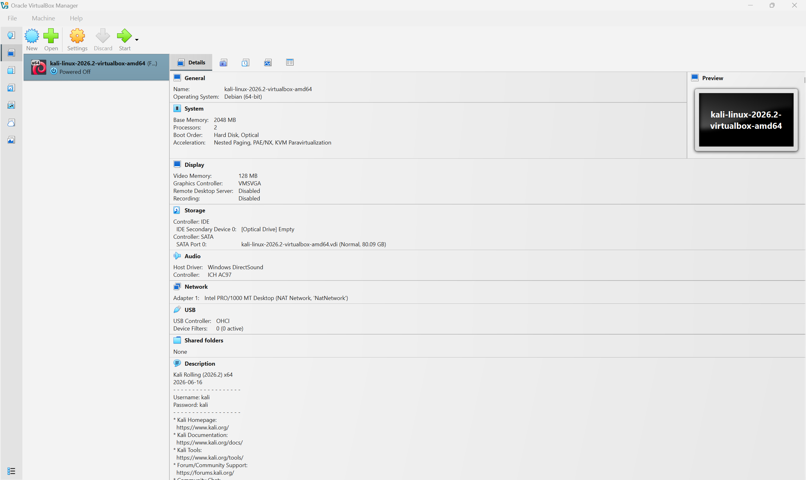
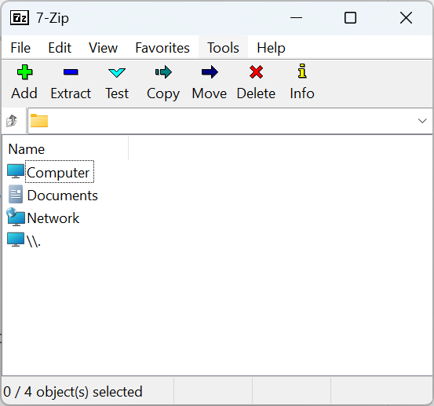
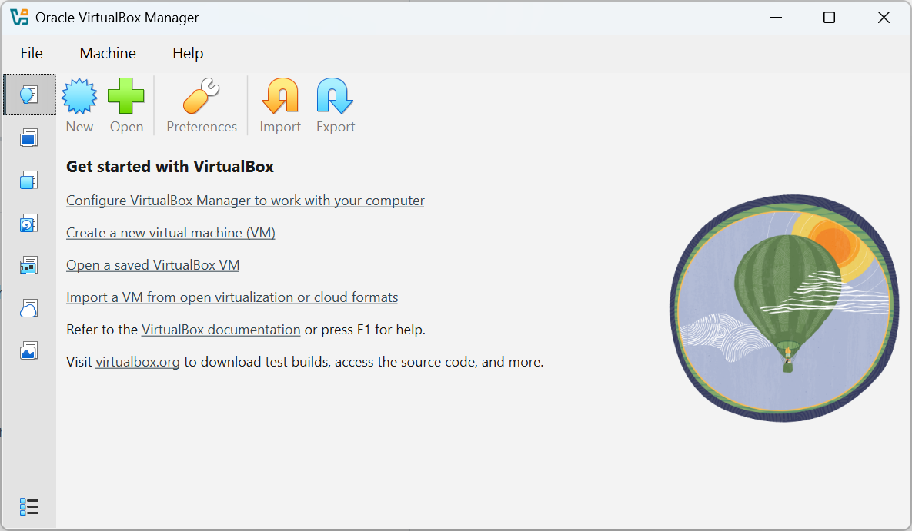
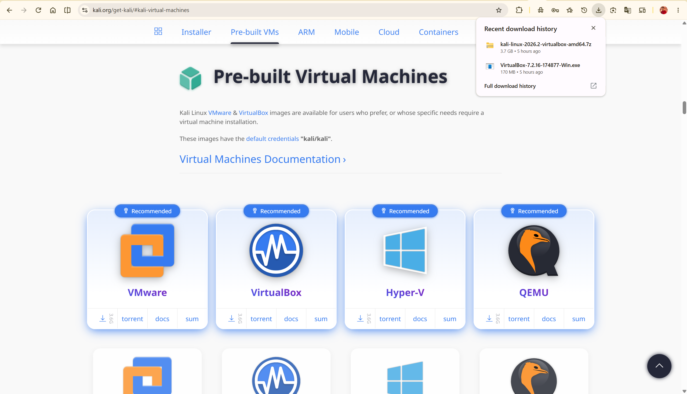
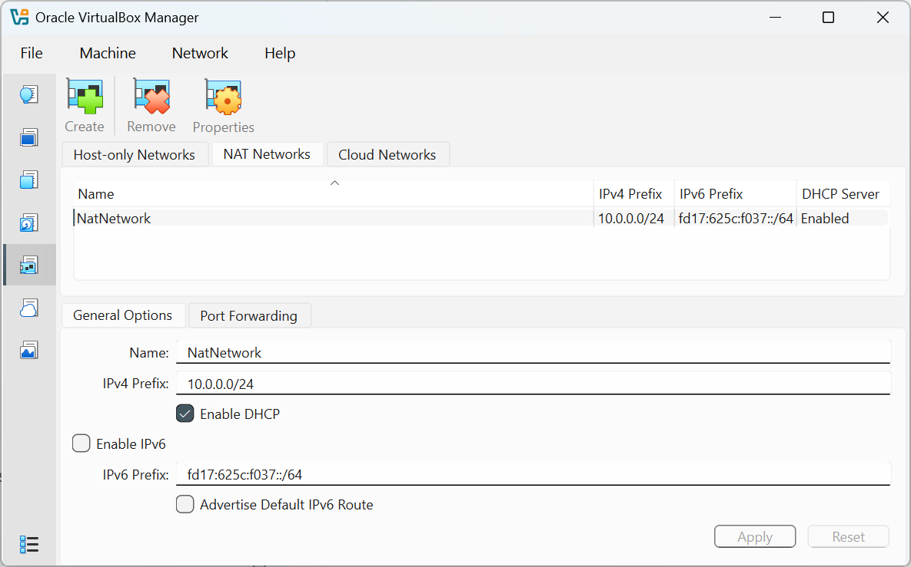
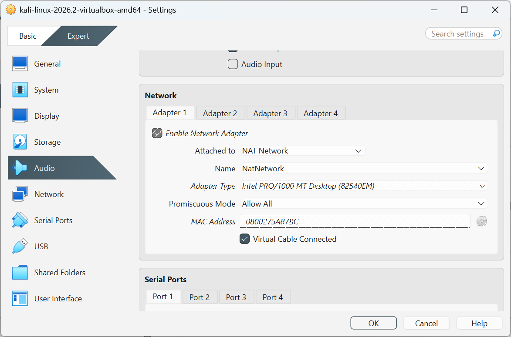
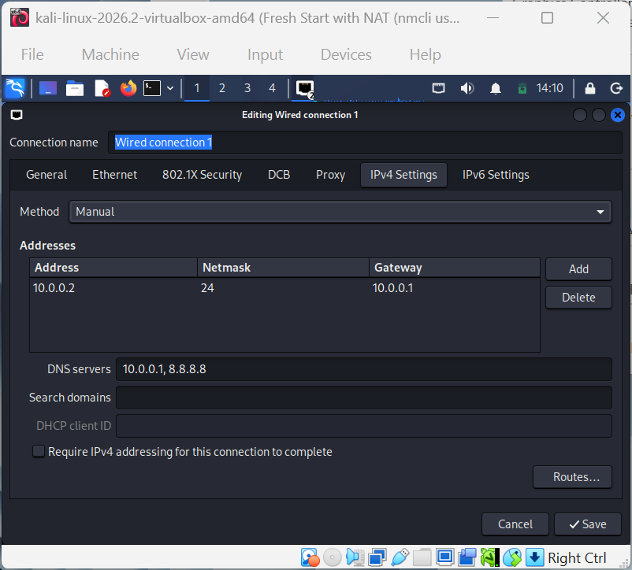
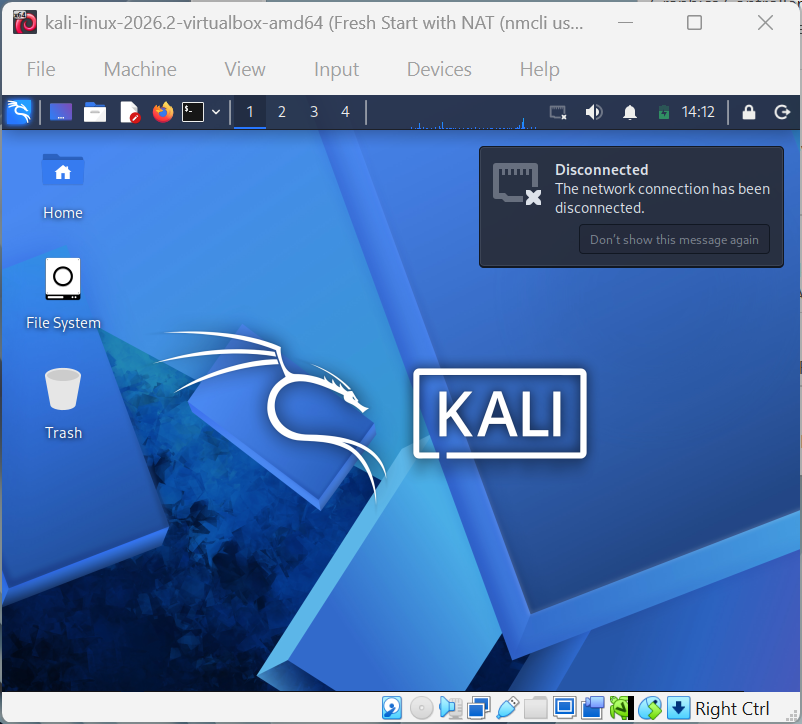
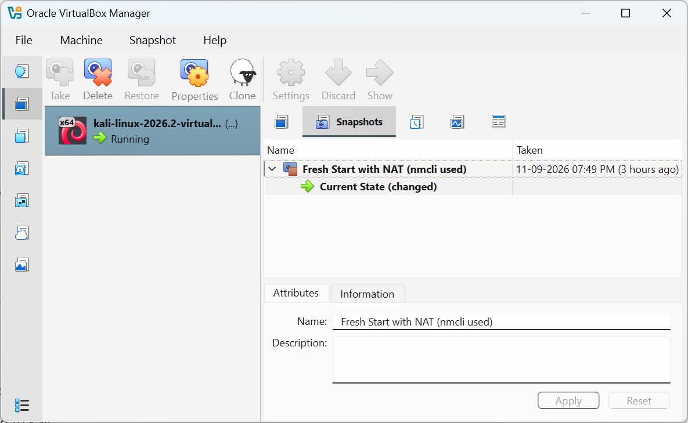

# Kali-Linux-Lab-Setup-in-Virtualbox

# 🖥️ Kali Linux VirtualBox Lab - My Own Isolated Cyber Playground

**A personal, hands-on build of a virtual cybersecurity lab which led to network hiccups, terminal victories, and all.**


---

## 📑 Table of Contents
 
- [Backstory](#-backstory)
- [What I Set Out to Do](#-what-i-set-out-to-do)
- [What This Lab Is For](#%EF%B8%8F-what-this-lab-is-for)
- [Lab Overview](#%EF%B8%8F-lab-overview)
- [Environment Specs](#%EF%B8%8F-environment-specs)
- [Build Walkthrough](#-build-walkthrough)
- [Verification & Testing](#-verification--testing)
- [Problems I Ran Into](#-problems-i-ran-into)
- [Lessons Learned](#-lessons-learned)
- [Ethical Use Notice](#-ethical-use-notice)
- [Tools & Resources](#-tools--resources)
- [Author](#-author)

---

## 📖 Backstory

Every cybersecurity journey needs a sandbox, and this repository documents mine. Instead of practicing scans, exploits, and reconnaissance on a live network (and possibly getting a guaranteed disconnection from my ISP), I built a self-contained, isolated lab using **VirtualBox** and **Kali Linux** - a space where I can break things, fix things, and break them again without any real-world consequences.

This isn't a copy-paste job either. Every screenshot here is from my own machine, every misstep is one I personally lived through, and every fix is one I actually typed into a terminal at some point while questioning my life choices.

---

## 🎯 What I Set Out to Do

- Install VirtualBox and get comfortable with its (occasionally opinionated with VMware) interface.
- Import and configure a Kali Linux virtual machine.
- Set up a proper virtual network so the VM talks to the internet without talking to anything it shouldn't.
- Confirm the Kali VM has a stable, working network connection.
- Take a clean snapshot so future-me has a "restore to sanity" button.
- Document the whole process, including the parts that didn't go smoothly, because a lab report that only shows the good parts is basically fiction.

---

## 🛡️ What This Lab Is For

This environment exists purely for **learning and authorized practice** — things like:

- Getting comfortable with the Kali Linux toolset
- Practicing network scanning and reconnaissance
- Exploring vulnerability assessment concepts
- Understanding virtual networking (NAT, adapters, IP addressing, etc.)
- General "let me poke this and see what happens" experimentation, safely contained

⚠️ **Disclaimer:** This lab is used strictly on systems I own or am explicitly authorized to test. No unauthorized scanning, no unauthorized poking, no exceptions.

---

## 🏗️ Lab Overview



The lab runs entirely inside VirtualBox on my laptop, isolated from my regular home network traffic, with room to add more virtual machines later if I want to build out a bigger multi-VM range.

---

## ⚙️ Environment Specs

| Component            | Details                                   |
|-----------------------|--------------------------------------------|
| 💻 Host Machine        | *Lenovo*               |
| 🧠 Host RAM            | *8 GB*                     |
| ⚡ Processor           | *intel i5 10210u*               |
| 🧰 Hypervisor          | VirtualBox *7.2.16 r174877*              |
| 🐉 Guest OS            | Kali Linux *2026.2*              |
| 🧠 Kali VM RAM         | *2048 MB*                          |
| 🌐 Network Mode        | *NAT Network*  |
| 📡 Kali IP Address     | *10.0.0.2/24*            |
| 🚪 Gateway             | *10.0.0.1/24*                   |
| 🌍 DNS                 | *8.8.8.8*                          |

---

## 🪜 Build Walkthrough

**Step 1 - Archive Tooling**
 
Downloaded and installed 7-Zip, needed to unpack the Kali Linux VM archive once it lands on disk.
 

 
**Step 2 - Hypervisor Installation**
 
Downloaded and installed VirtualBox as the hypervisor for the whole operation. Nothing dramatic here, yet.
 

 
**Step 3 - Kali Linux Image Import**
 
Downloaded the official Kali Linux VirtualBox image from Kali's website, extracted it with 7-Zip, and imported it as a new virtual machine. Kali ships pre-loaded with more security tools than I currently know what to do with, which is exactly the point.


 
**Step 4 - NAT Network Configuration**
 
This is the step that actually needed some thought. Rather than leaving each VM on its own private NAT (where VMs can reach the internet but not each other), I set up a dedicated **NAT Network** in VirtualBox — a shared virtual switch that lets every VM attached to it reach both the internet *and* each other, which matters the moment a second VM joins the lab.
 
Created in VirtualBox Manager under **Tools → Network → NAT Networks**:
 
```
Name:         NatNetwork
IPv4 Prefix:  10.0.0.0/24
DHCP:         Enabled
IPv6:         Disabled
```
 

 
With the network created, I attached Kali's Adapter 1 to it:
 
```
Attached to:      NAT Network
Name:             NatNetwork
Adapter Type:     Intel PRO/1000 MT Desktop
Promiscuous Mode: Allow All
```


 
I then reserved `10.0.0.2` for Kali out of the wider `10.0.0.2-99/24` range, so the rest of the block stays free for future target machines, and set it manually inside Kali:
 
```
Address:     10.0.0.2
Netmask:     24
Gateway:     10.0.0.1
DNS servers: 8.8.8.8   (fallback: 10.0.0.1, if internet gives issues)
```
 

 
**Step 5 - Resource Allocation**
 
Assigned RAM and virtual disk space to the Kali VM to keep it responsive without turning my laptop into a space heater.
 
```
RAM: 2048 MB
Storage: 20 GB
```
 
**Step 6 - Boot & Network Check**
 
Powered on Kali, logged in, and checked that networking was actually functional — which, spoiler alert, is where the fun began. (See the Troubleshooting Log below.)
 

 
**Step 7 - Baseline Snapshot**
 
Once everything was stable and verified, I took a VirtualBox snapshot so I have a known-good checkpoint to roll back to if a future experiment goes sideways.
 
```
Snapshot name: Fresh Start with NAT (nmcli used)
```


---

## 🔎 Verification & Testing

| Test                     | Command                    | What I Expected           |
|----------------------------|------------------------------|------------------------------|
| Check IP address            | `ip a`                        | Correct IP assigned to Kali |
| Test gateway reachability   | `ping 10.0.0.1`           | Successful replies          |
| Test internet connectivity  | `ping 8.8.8.8`                 | Successful replies          |
| Test DNS resolution         | `nslookup google.com`         | Domain resolves correctly   |
| Confirm snapshot works      | Restore snapshot, re-run `ip a` | Baseline network restored  |

---

## 🐛 Problems I Ran Into

### The Case of the Vanishing Internet Connection

Here's where things got interesting. Partway through setup, my Kali VM decided it no longer wanted anything to do with the internet. The network icon just sat there looking unbothered and `ping`s to `8.8.8.8` vanished into the void. Classic case of "it worked five minutes ago."

I went through the usual suspects - checked the VirtualBox adapter settings, toggled the connection off and on through the GUI, restarted the VM and questioned my career choices. Finally, I landed on the actual fix: managing the network connection directly through `nmcli` instead of relying on the graphical network manager, which was being unreliable about actually applying changes.

What sorted it out:

```
sudo nmcli connection modify "Wired connection 1" ipv4.dad-timeout 0
```

Once I brought the connection up manually through `nmcli`, the disconnections stopped and stayed stopped for the rest of the session. Turns out the NetworkManager's DAD (Duplicate Address Detection) timeout was stalling the connection.

> **Lesson learned:** when the network manager starts acting moody, `nmcli` is the calmer, more reliable friend who actually gets things done.

---

## 💡 Lessons Learned

**Virtual networking isn't just a checkbox.** NAT, NAT Network, and Bridged mode all behave differently, and picking the right one matters if you want your VM to talk to the internet *and* to other VMs later.

**The terminal is more trustworthy than the GUI, at least for networking.** After the `nmcli` incident, I'm far more comfortable diagnosing and fixing network issues from the command line instead of clicking around a settings panel and hoping for the best.

**Snapshots are a safety net, not a luxury.** Knowing I can roll back to a clean state means I can experiment more freely without the fear of having to rebuild the whole VM from scratch.

**Documentation matters, even the messy parts.** Writing down what broke and how I fixed it turned out to be more useful than writing down what worked on the first try.

---

## 🔐 Ethical Use Notice

This lab is built and used strictly for educational purposes, on systems I own or have explicit permission to test. Please don't use anything in this repository to test systems you don't have authorization for; that's not a lab exercise, that's a legal problem.

---

## 🔗 Tools & Resources

- **7-Zip** <https://7-zip.org>
- **VirtualBox:** <https://www.virtualbox.org/wiki/Downloads>
- **Kali Linux:** <https://www.kali.org/get-kali/>

---

## 👤 Author

**Suvayan Ghosh**
Cybersecurity Enthusiast | Kolkata, India

**Linkedin:** *https://linkedin.com/in/suvayanghosh/*

---

## 📌 Project Info

**Type:** Personal Cybersecurity Lab Setup | **Environment:** VirtualBox + Kali Linux | 
**Status:** Ongoing - more VMs and exercises to be added over time
